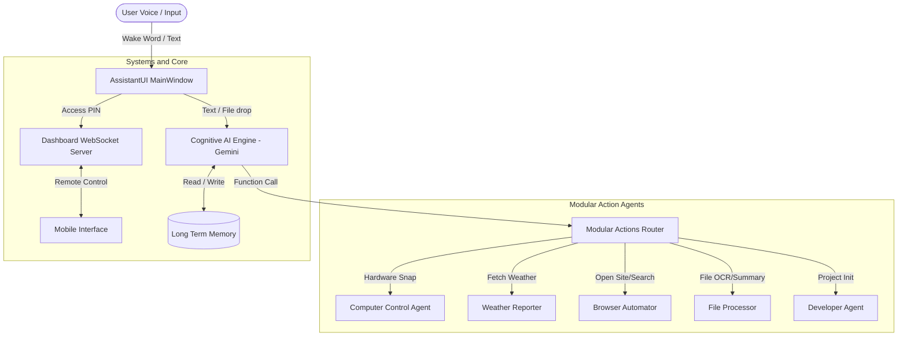

# ⚡ K-10 Assistant ⚡

<p align="center">
  
</p>

<p align="center">
  <b>A Minimal, Modern, Futuristic, and Premium Cognitive AI Desktop Assistant</b><br>
  <sub>Designed & Developed by <a href="https://github.com/thekrishna7">@thekrishna.builds</a></sub>
</p>

<p align="center">
  
</p>

---

## ◈ Project Description

**K-10 Assistant** is a production-grade, highly optimized desktop AI assistant designed for developers, content creators, and power users. Running as a native Windows application with a stunning **Neon Blue + Cyan Glassmorphism** interface, K-10 Assistant integrates deep LLM reasoning (powered by Google Gemini 3.5 Flash), voice activity recognition, hardware automation, long-term cognitive memory, and multi-device remote synchronization.

Unlike generic chat interfaces, K-10 Assistant operates as an active chief of staff—listening for system-level shortcuts, processing drag-and-dropped files, executing localized terminal commands, adjusting display/audio systems, and managing workflows autonomously.

---

## 🌟 Key Features

*   🎙️ **High-Fidelity Voice Control**: System-wide voice activation utilizing a local speech-recognition wake engine.
*   🧠 **Long-Term Cognitive Memory**: Persistent local JSON memory database that tracks user preferences, relationships, wishes, and project contexts.
*   🖥️ **Systemsnapping & Hardware Control**: Snaps active windows into 2-way splits or 4-way quadrants, controls volume, brightness, AC controls, and monitors CPU/RAM/Disk metrics in real-time.
*   ☁️ **Multi-Device Remote Link**: Integrates a web dashboard server allowing users to control their PC, transmit audio/text commands, and view logs directly from a mobile browser.
*   📎 **Dynamic File Processing**: OCR text extraction, image synthesis, file conversions, and document summaries through standard Drag-and-Drop file uploads.
*   ⚙️ **Secure API Storage**: Isolated configuration dialogue that protects system keys and paired links.

---

## 📐 Architecture & Components

K-10 Assistant operates as a modular multi-agent system coordinating UI actions, background tasks, voice loops, and API clients.



---

## 📂 Project Structure

```plaintext
K-10 Assistent/
│
├── actions/                  # Modular Action Controllers
│   ├── browser_control.py    # Search and browser integrations
│   ├── computer_control.py   # Volume, brightness, AC controls
│   ├── computer_settings.py  # Snap split window layouts
│   ├── dev_agent.py          # Autocomplete software builder
│   ├── file_controller.py    # Text writer and viewer
│   ├── file_processor.py     # Image OCR and PDF Summarizer
│   └── weather_controller.py # Weather API parsing to HUD
│
├── assets/                   # Premium Branding Kit
│   ├── logo_transparent.png  # Icon for UI layout
│   ├── social_preview.png    # GitHub header banner
│   ├── logo.ico              # Windows executable icon
│   └── favicon.ico           # Web dashboard icon
│
├── config/                   # Configuration Files
│   └── config.json           # User AI key storage (gitignored)
│
├── core/                     # Core Agent System Instructions
│   └── prompt.txt            # System identity rules
│
├── dashboard/                # Remote Link Web Server
│   ├── index.html            # Web remote controller
│   └── server.py             # FastAPI websockets server
│
├── memory/                   # Cognitive Database
│   ├── long_term.json        # User facts database
│   └── memory_manager.py     # CRUD operations for memory
│
├── main.py                   # Main Application Bootstrapper
├── settings.py               # Settings & About Page dialogs
├── ui.py                     # PyQt6 Neon Cyber Dashboard UI
└── wake_word.py              # Voice Listener Thread
```

---

## 🛠️ Installation & Setup

### 📋 Prerequisites & System Requirements
*   **Operating System**: Windows 10 / 11 (Required for native window snapping, system audio, & hardware metrics)
*   **Python**: Version 3.10 to 3.12 (Make sure Python is added to your system `PATH`)
*   **Hardware**: Working Microphone & Speaker/Headphones (for PyAudio voice commands and TTS output)
*   **API Key**: Free Google AI Studio API Key ([Get Gemini API Key](https://aistudio.google.com/))

---

### 🚀 Step-by-Step Installation Commands

#### Step 1: Clone the Repository & Navigate to Directory
```bash
git clone https://github.com/thekrishna7/K-10-Assistant
cd K-10-Assistant
```

#### Step 2: Create & Activate Virtual Environment (Recommended)
```bash
# Create virtual environment
python -m venv venv

# Activate virtual environment (Windows PowerShell)
.\venv\Scripts\Activate.ps1

# OR Activate virtual environment (Windows Command Prompt - CMD)
venv\Scripts\activate.bat
```

#### Step 3: Install Required Dependencies

**Option A: Automated Setup (Recommended)**
Runs pip install for `requirements.txt` and sets up Playwright browsers automatically:
```bash
python setup.py
```

**Option B: Manual Installation**
If you prefer running commands individually:
```bash
# Upgrade pip to latest version
python -m pip install --upgrade pip

# Install all Python requirements
pip install -r requirements.txt

# Install Playwright browser engines (used for browser control action)
playwright install
```

#### Step 4: Launch Main Application
```bash
python main.py
```

*Note: On your first launch, a secure dialog will pop up asking for your **Google Gemini API Key**. Enter your API key to save it in `config/config.json` and initialize the assistant.*

---

## 🔧 Environment & Configuration

*   **API Configuration**: Kept inside `config/config.json`. Automatically generated after entering the key in the startup dialogue.
*   **Speech synthesis**: Dynamically utilizes `edge-tts` to speak output with zero external subscriptions.

---

## 🎤 Voice Commands & Wake Phrases

To wake the assistant using your voice, speak:
*   *"Wake up K-10 Assistant"*
*   *"Hey K-10 Assistant"*
*   *"K-10 Assistant"*

### Voice Responses
The assistant will greet you with one of its core identity strings:
*   *"Hello, I am K-10 Assistant."*
*   *"My name is K-10 Assistant."*
*   *"I am your AI Assistant K-10."*

---

## 🚀 Roadmap

- [x] Retheme dashboard with premium Neon Blue + Cyan theme.
- [x] Package standalone executable for Windows.
- [ ] Add Local LLM fallback (Ollama Integration).
- [ ] Implement smart home device discovery (Zigbee/Home Assistant support).
- [ ] Enable advanced voice cloning.

---

## ❓ FAQ

#### Q: Does K-10 Assistant require a local Python installation to run?
A: No. By downloading the packaged Standalone EXE, you can run K-10 Assistant as a native Windows application with zero dependencies.

#### Q: How does the memory system work?
A: Any important facts you tell the assistant are parsed and saved to `memory/long_term.json`. The assistant retrieves these facts on startup and injects them into the Gemini context.

---

## 💻 Developer

*   **Lead Architect**: Krishna Sharma
*   **Brand Identity**: [@thekrishna.builds](https://github.com/thekrishna7)

---

## 📜 License

Designed & Developed by @thekrishna.builds  
Copyright © 2026 @thekrishna.builds. All Rights Reserved.  
Licensed under the [MIT License](file:///d:/ALL%20PYTHON%20PROJECTS/K-10%20Assistent/LICENSE).
